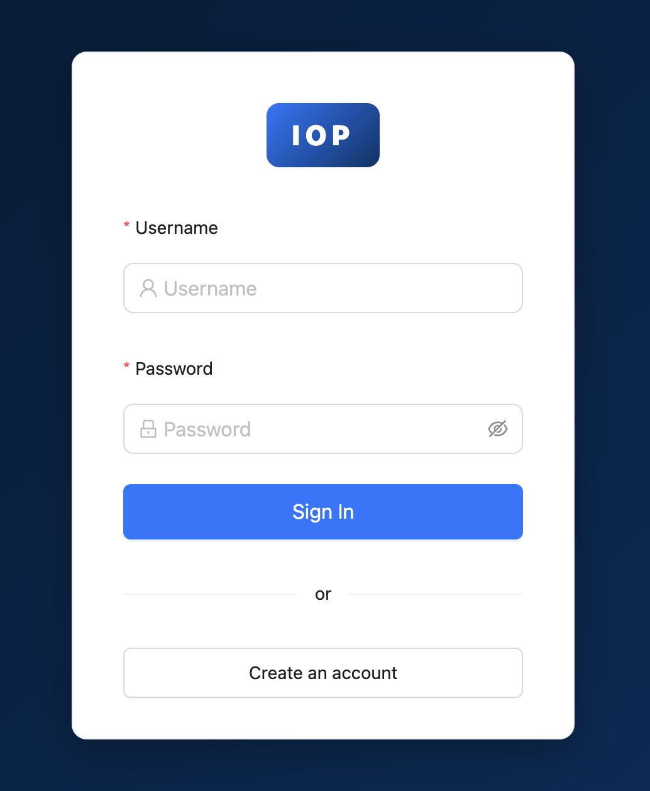
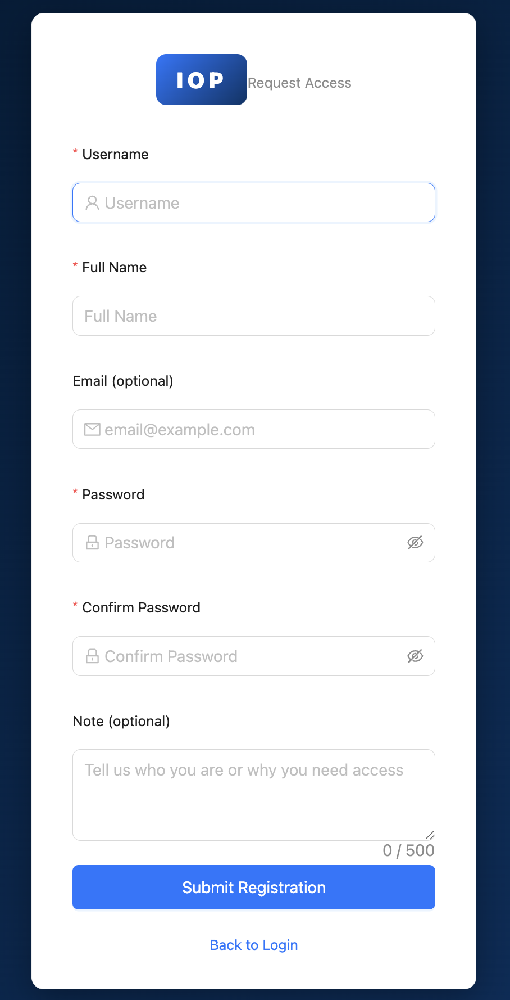
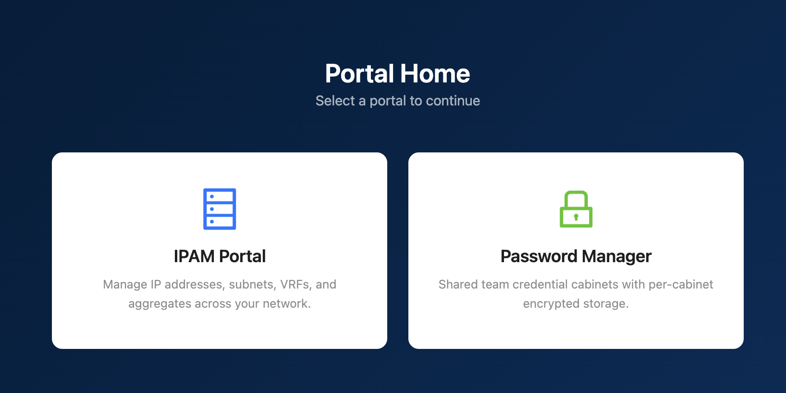
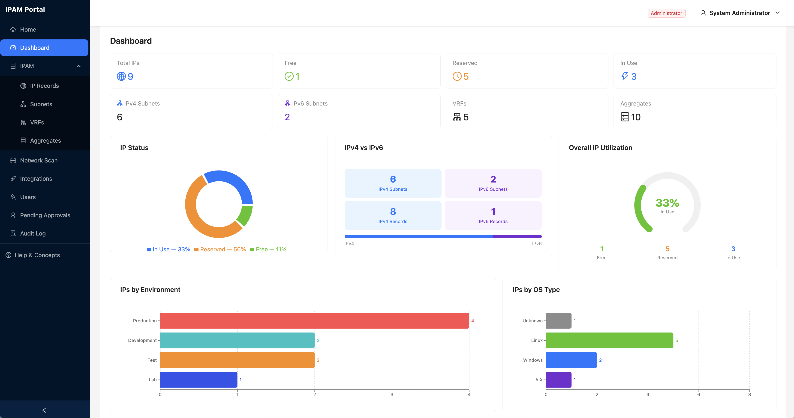
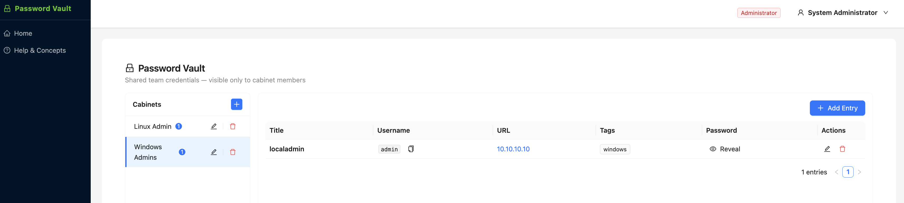

# IOP — Infrastructure Operations Platform

A self-hosted IP Address Management portal with NetBox-style prefix hierarchy, dual-stack IPv4/IPv6, vSphere VM import, DNS conflict detection, Password Vault, and optional LDAP/AD authentication.

---

## Stack

| Layer | Technology |
|-------|-----------|
| Backend | Python 3.11 · FastAPI · Motor (async MongoDB) · Pydantic v2 |
| Frontend | React 18 · Vite · TypeScript · Ant Design 5 · recharts |
| Database | MongoDB 7 |
| Auth | JWT (HS256) · local accounts · self-registration with admin approval · optional LDAP/AD via ldap3 |
| Container | Docker Compose · Nginx reverse proxy |

---

## Quick Start

```bash
git clone <repo-url> && cd iop
cp backend/.env.example backend/.env   # edit values
docker compose up --build -d
```

Portal available at **http://localhost**. Default login is set via `INITIAL_ADMIN_USERNAME` / `INITIAL_ADMIN_PASSWORD` in `.env`.

**Rebuild after code changes:**
```bash
docker compose build frontend api && docker compose up -d frontend api
```

---

## Screenshots

### Login


### Self-Registration


### Portal Home


### IPAM Dashboard


### Password Vault


---

## Configuration (`backend/.env`)

| Variable | Default | Description |
|----------|---------|-------------|
| `MONGODB_URI` | `mongodb://…` | MongoDB connection string |
| `MONGODB_DB_NAME` | `ipam` | Database name |
| `JWT_SECRET_KEY` | — | JWT signing secret (required, ≥32 chars) |
| `JWT_EXPIRE_MINUTES` | `60` | Token lifetime |
| `INITIAL_ADMIN_USERNAME` | `admin` | Bootstrap admin (remove after first login) |
| `INITIAL_ADMIN_PASSWORD` | — | Bootstrap admin password |
| `VAULT_MASTER_KEY` | — | AES-256-GCM master key for Password Vault (base64, min 32 bytes) |
| `LDAP_ENABLED` | `false` | Enable LDAP/AD login |
| `LDAP_SERVER` | — | LDAP server hostname |
| `LDAP_PORT` | `389` | LDAP port |
| `LDAP_USE_TLS` | `true` | Use STARTTLS |
| `LDAP_BIND_DN` | — | Service account DN for user search |
| `LDAP_BIND_PASSWORD` | — | Service account password |
| `LDAP_BASE_DN` | — | Search base (e.g. `DC=corp,DC=example,DC=com`) |
| `LDAP_USER_FILTER` | `(sAMAccountName={username})` | User search filter |
| `LDAP_DEFAULT_ROLE` | `Viewer` | Role for auto-provisioned LDAP users |

---

## Features

### Core
- Subnet management (CIDR, gateway, VLAN, environment, VRF, alert threshold)
- IP record tracking: hostname, OS type, owner, status (Free / Reserved / In Use)
- Automatic prefix nesting — smaller CIDRs become children of larger ones
- VRFs — isolated routing domains with optional Route Distinguisher
- Aggregates & RIRs — top-level address blocks (ARIN, RIPE NCC, APNIC, LACNIC, AFRINIC, RFC1918)
- IP Ranges — named spans (e.g. DHCP pools) within a subnet
- CSV import / export with validation and template download

### Dashboard & Operations
- recharts dashboard: IP status donut, environment bar, OS bar, top subnets, recent activity
- Subnet utilization alert threshold — warning badge on row + dashboard banner when exceeded
- Bulk reserve / release / update-fields for multiple IP records
- Per-record change history with before→after field diffs

### Network Scanner
- TCP-based host discovery for any CIDR; no ICMP/root needed
- OS fingerprinting (Linux, Windows, macOS, OpenShift, AIX) + reverse DNS
- Select discovered hosts → bulk-import as IP records

### IPv6, LDAP, Integrations & DNS Conflicts
- **IPv6 dual-stack** — subnets and IP records support both IPv4 and IPv6; ip_version badge in table
- **LDAP/AD authentication** — optional; first-login auto-provisions user as Viewer; local auth unchanged
- **DNS conflict detection** — per-subnet scan: FORWARD_MISMATCH, PTR_MISMATCH, NO_FORWARD, DUPLICATE_HOSTNAME
- **vSphere VM import** — connect to vCenter, select VMs, map to subnets, bulk-import as IP records
- **Smart subnet creation** — when adding an IP that doesn't fit any subnet, inline prompt auto-suggests the CIDR and creates + selects it

### Password Vault
- Cabinet-based secret storage: each cabinet has a name, description, and explicit member list
- AES-256-GCM encryption per cabinet key derived via HKDF-SHA256 from `VAULT_MASTER_KEY`
- Per-entry reveal with 30-second auto-clear (password never persists in frontend state)
- Administrators manage cabinets; cabinet membership controls access regardless of IPAM role
- Full audit trail: `REVEAL`, `CREATE`, `UPDATE`, `DELETE` actions logged per entry

### Self-Registration with Admin Approval
- Public `/register` page — any visitor can submit a registration request with username, full name, email, password, and an optional note
- New registrations land in **pending** state (`is_active=False`) — no login until approved
- Administrators see a **Pending Approvals** page (sidebar badge shows live count)
- Approve: assign role (Viewer / Operator / Administrator) and optionally add the user to one or more Vault cabinets in the same step
- Reject: optional reason stored for audit; rejected users receive a clear message on login attempt
- Admin-created users (via Users page) bypass approval entirely and can log in immediately
- LDAP auto-provisioned users are unaffected — they are auto-approved on first login as before
- Registration endpoint is rate-limited at 5 requests/minute

---

## User Roles

| Role | Permissions |
|------|-------------|
| **Viewer** | Read-only: all IPAM pages, change history, Vault (own cabinets) |
| **Operator** | Viewer + create/edit/reserve/release, bulk ops, network scan, DNS conflict scan, vSphere import, subnet quick-create |
| **Administrator** | Operator + delete, user management, audit log, pending approvals, cabinet management |

---

## API Reference

All endpoints prefixed `/api/v1`. Auth via `Authorization: Bearer <token>`.

### Auth

| Method | Path | Auth | Description |
|--------|------|------|-------------|
| POST | `/auth/register` | — | Submit self-registration (rate-limited 5/min) |
| POST | `/auth/login` | — | Login (local or LDAP) |
| POST | `/auth/logout` | Viewer+ | Invalidate token |
| GET | `/auth/config` | — | `{ldap_enabled: bool}` |
| GET | `/auth/me` | Viewer+ | Current user |
| POST | `/auth/change-password` | Viewer+ | Change password (local only) |

### Users

| Method | Path | Auth | Description |
|--------|------|------|-------------|
| GET | `/users` | Admin | List all users |
| POST | `/users` | Admin | Create user (bypasses approval) |
| GET | `/users/pending` | Admin | List pending registrations |
| POST | `/users/{id}/approve` | Admin | Approve with role + cabinet assignments |
| POST | `/users/{id}/reject` | Admin | Reject with optional reason |
| GET/PUT/DELETE | `/users/{id}` | Admin | Get / update / delete user |
| POST | `/users/{id}/reset-password` | Admin | Reset password |
| POST | `/users/{id}/activate` | Admin | Activate user |
| POST | `/users/{id}/deactivate` | Admin | Deactivate user |

### Subnets

| Method | Path | Auth |
|--------|------|------|
| GET/POST | `/subnets` | Viewer / Operator+ |
| GET | `/subnets/tree` | Viewer+ |
| GET/PUT/DELETE | `/subnets/{id}` | Viewer / Operator+ / Admin |
| GET | `/subnets/{id}/detail` | Viewer+ |
| POST | `/subnets/{id}/scan-conflicts` | Operator+ |

### IP Records

| Method | Path | Auth |
|--------|------|------|
| GET/POST | `/ip-records` | Viewer / Operator+ |
| GET/PUT/DELETE | `/ip-records/{id}` | Viewer / Operator+ / Admin |
| POST | `/ip-records/{id}/reserve` | Operator+ |
| POST | `/ip-records/{id}/release` | Operator+ |
| GET | `/ip-records/{id}/history` | Viewer+ |
| POST | `/ip-records/bulk/reserve` | Operator+ |
| POST | `/ip-records/bulk/release` | Operator+ |
| POST | `/ip-records/bulk/update` | Operator+ |
| GET | `/ip-records/export` | Viewer+ |
| POST | `/ip-records/import` | Operator+ |
| GET | `/ip-records/by-ip/{ip_address}` | Viewer+ |

### Other Resources

| Resource | Base path | Notes |
|----------|-----------|-------|
| VRFs | `/vrfs` | Full CRUD |
| Aggregates | `/aggregates` | Full CRUD |
| RIRs | `/rirs` | GET (Viewer+), POST (Admin) |
| IP Ranges | `/ip-ranges` | Full CRUD |
| Network Scanner | `/scanner/scan` | POST, Operator+ |
| vSphere Discover | `/integrations/vsphere/discover` | POST, Operator+ |
| vSphere Import | `/integrations/vsphere/import` | POST, Operator+ |
| Dashboard Stats | `/stats` | GET, Viewer+ |
| Cabinets | `/cabinets` | Admin CRUD; member list controls access |
| Password Entries | `/passwords` | Viewer (own cabinets); reveal via `/{id}/reveal` |

---

## Project Structure

```
iop/
├── backend/
│   └── app/
│       ├── config.py            Settings (Pydantic BaseSettings)
│       ├── main.py              FastAPI app + router registration
│       ├── core/
│       │   ├── vault.py         AES-256-GCM encryption + HKDF key derivation
│       │   └── …                database, security, password, rate_limiter
│       ├── models/              MongoDB document models
│       ├── schemas/             Pydantic request/response schemas
│       │   └── registration.py  RegisterRequest, ApproveRequest, RejectRequest
│       ├── repositories/        BaseRepository[T] + domain repos
│       ├── services/            Business logic (auth, user, subnet, vault, …)
│       └── routers/             FastAPI routers
├── frontend/
│   └── src/
│       ├── api/                 Axios API clients
│       ├── components/          Shared UI (Sidebar, HelpDrawer, VaultLayout, …)
│       ├── pages/
│       │   ├── Registration/    Self-registration form + success card
│       │   ├── Users/           UsersPage, PendingApprovalsPage, ApproveModal
│       │   ├── Vault/           Cabinet browser + password entries
│       │   └── …                Dashboard, IPRecords, Subnets, VRFs, etc.
│       ├── types/               TypeScript types
│       └── constants/           Environments, OS colors, etc.
├── mongodb/init.js              Index definitions (including approval_status)
├── nginx/nginx.conf
└── docker-compose.yml
```

---

## Changelog

### v4.0.0
- **Self-registration with admin approval** — public `/register` page; pending users cannot log in until an administrator approves them with a role and optional cabinet assignments; rejected users receive a clear error message on login; admin sidebar shows live pending count badge
- **Password Vault** — cabinet-based secret storage with AES-256-GCM encryption (HKDF-SHA256 per-cabinet key from `VAULT_MASTER_KEY`); 30-second reveal with auto-clear; full audit trail
- **Portal home page** — `/` landing page to choose between IPAM and Vault portals after login
- New audit actions: `REGISTER`, `APPROVE`, `REJECT`, `REVEAL`

### v3.0.0
- IPv6 dual-stack: subnets and IP records support IPv4 and IPv6; ip_version badge in table
- Optional LDAP/AD authentication with auto-provisioning on first login
- DNS conflict detection per subnet (FORWARD_MISMATCH, PTR_MISMATCH, NO_FORWARD, DUPLICATE_HOSTNAME)
- vSphere VM import via pyVmomi: 3-step wizard (connect → select VMs → results)
- Smart subnet creation: when adding an IP not covered by any subnet, inline modal pre-fills CIDR and auto-selects after creation
- Fix: cross-version `subnet_of()` TypeError on `/aggregates` (IPv4 vs IPv6 comparison)
- Fix: integrations subnet loader hit page_size cap; now paginates correctly

### v2.1.0
- recharts dashboard (IP status donut, environment/OS bar charts)
- Subnet utilization alert thresholds with dashboard banner
- Bulk reserve / release / update-fields for IP records
- Per-record change history drawer with before→after diffs

### v2.0.0
- NetBox-style prefix nesting with auto-parent detection and reparenting
- IP Ranges (DHCP pools, reserved blocks)
- Aggregates & RIRs
- VRF-scoped subnet trees

### v1.3.0
- On-demand network scanner (TCP + reverse DNS)
- macOS and OpenShift OS type detection
- Subnet utilization fix

### v1.2.0
- CSV import / export

### v1.0.0
- Initial release: subnets, IP records, VRFs, environments, user management, audit log
